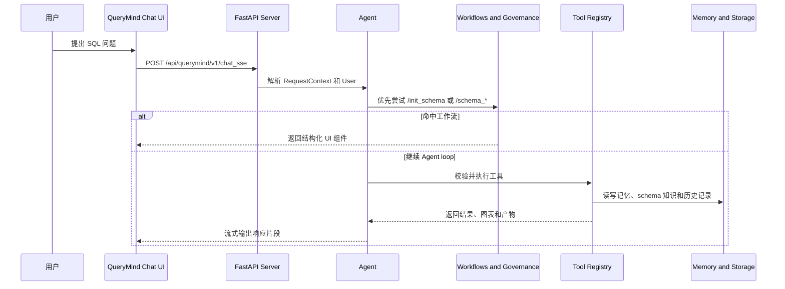

# QueryMind

[](README.md)

QueryMind 是一个面向 SQL 工作流的 LLM Agent 框架，提供 FastAPI 后端、webcomponent 演示前端、显式的 schema 和 SQL 治理层，以及评测框架。
- 完整文档：[docs/zh/querymind.md](docs/zh/querymind.md)
- 与 Vanna 2.0 的差异： [查看对比章节](#whats-new)
- 许可证：[MIT](#license)

---

## 核心特性

- 统一的 Sample Agent：`querymind` 可以启动后端、前端或两者一起，直接跑通完整 Agent 闭环。
- 分离的记忆层：Agent Memory 使用 Mem0，Schema Memory 使用 Neo4j + Mem0 的混合检索，会话存储与其独立。
- Schema 工作流：`/init_schema`、`/schema_list`、`/schema_detail`、`/schema_enrich` 都是确定性的管理员工作流，而不是普通聊天提示词。
- SQL 治理与 RLS：工具注册支持访问组控制，SQL 在执行前可以经过治理校验、行级安全、注入防护和复杂度检查。
- 丰富的流式 UI：webcomponent 包含 chat、progress、status、chart、task、card 和 schema management 等组件，可接收结构化流式响应。
- 可观测性与可审计性：后端提供 Prometheus 指标、PostgreSQL 审计日志，以及可复现的评测 CLI 和报告产物。
- Provider 灵活性：集成层包含 OpenAI-compatible、Anthropic、vLLM，以及 PostgreSQL、SQLite、Neo4j 等基础组件。

<a id="whats-new"></a>

## QueryMind 相比 Vanna 2.0 的新内容

相比 Vanna 2.0，QueryMind 更强调一个显式的、面向 SQL 治理和评测的 Agent Runtime。

- 显式治理管线：`SchemaGovernanceStack` 和 `SqlGovernanceStack` 通过 hooks、middlewares 和 context enhancers 接入 Agent loop，而不是只在外围包一层。
- 确定性的管理员工作流：`/init_schema` 和 `/schema_*` 命令由 workflow handler 处理，可以在进入 LLM 之前短路，并返回专用 UI 组件。
- 分离的记忆层：Agent memory、conversation storage 和 schema memory 分开管理。Schema memory 基于 Neo4j + Mem0，同时支持向量和图检索。
- 面向用户的执行控制：HTTP 边界会解析 `RequestContext` 和 `User`，工具带有访问组，`RLSToolRegistry` 可以在执行前做 RLS、注入和复杂度检查。
- 内建运维与遥测：后端提供 `/metrics`、PostgreSQL 审计日志、恢复策略，以及带 resume point 和 report 的数据集评测 CLI。
- 向后兼容的前端导出：webcomponent 包同时导出 QueryMind 组件和 Vanna 兼容别名，方便平滑演进 UI 层。

## 工作方式



QueryMind 把工作流边界显式化：请求上下文和管理员路由先于工具执行完成，结果再以结构化 UI 组件流回前端。

## 快速开始

运行仓库内置的 Sample Agent，可以把后端、前端、记忆、治理和评测完整串起来。

示例 agent 的核心构建方式如下：

```python
from QueryMind import (
    Agent,
    AgentConfig,
    CompositeLlmContextEnhancer,
    CompositeWorkflowHandler,
    ExponentialBackoffStrategy,
    Neo4jMem0SchemaManagementService,
    Neo4jMem0SchemaMemory,
    PrometheusObservabilityProvider,
)
from QueryMind.core.agent import build_schema_governance_stack, build_sql_governance_stack
from QueryMind.core.enricher import SchemaRetrieveContextEnricher
from QueryMind.integrations.agentmemory import Mem0AgentMemory, create_config_from_env
from QueryMind.integrations.auditlogger import PostgresAuditLogger
from QueryMind.integrations.llmservice import OpenAILlmService
from QueryMind.integrations.local import FileSystemConversationStore
from QueryMind.integrations.schemamemory import Mem0VectorConfig, Neo4jConfig
from QueryMind.rls_registry import RLSToolRegistry

schema_governance = build_schema_governance_stack()
sql_governance = build_sql_governance_stack()

agent = Agent(
    llm_service=OpenAILlmService(...),
    tool_registry=RLSToolRegistry(audit_logger=PostgresAuditLogger(...)),
    user_resolver=...,
    agent_memory=Mem0AgentMemory(config=create_config_from_env()),
    conversation_store=FileSystemConversationStore(...),
    config=AgentConfig(...),
    workflow_handler=CompositeWorkflowHandler([...]),
    schema_memory=Neo4jMem0SchemaMemory(
        neo4j_config=Neo4jConfig.from_env(),
        mem0_config=Mem0VectorConfig.from_env(),
    ),
    schema_management_service=Neo4jMem0SchemaManagementService(...),
    hooks=[schema_governance.hook, sql_governance.hook],
    llm_middlewares=[schema_governance.middleware, sql_governance.middleware],
    llm_context_enhancer=CompositeLlmContextEnhancer([...]),
    context_enrichers=[SchemaRetrieveContextEnricher(...)],
    error_recovery_strategy=ExponentialBackoffStrategy(),
    observability_provider=PrometheusObservabilityProvider(),
)
```

### 前置准备

- QueryMind Python SDK：见 [0. QueryMind Python SDK](docs/zh/support/prerequisite.md#querymind-python-sdk)。
- PostgreSQL & PgVector：见 [1. PostgreSQL & PgVector](docs/zh/support/prerequisite.md#postgresql-pgvector)。
- AdventureWorks：见 [2. AdventureWorks](docs/zh/support/prerequisite.md#adventureworks)。
- 环境变量配置：见 [3. 环境变量配置](docs/zh/support/prerequisite.md#environment-variables-configuration)。

这份部署指南还会补充 Neo4j、PostgreSQL 审计日志和 demo 前端构建所需的内容。

### 依赖安装

```bash
uv sync
cd frontends/webcomponent
npm install
npm run build
```

如果你更习惯可编辑安装，也可以使用 `pip install -e .` 作为 fallback。

### 使用 `querymind` 启动项目

```bash
querymind agent-only
querymind web-only
querymind demo
```

这三个模式同时通过 `querymind` console script 和仓库根目录的 `querymind.py` 包装器提供。

- `agent-only`：只启动后端 Agent。
- `web-only`：只启动前端 demo。
- `demo`：同时启动后端和前端，并自动打开 demo 页面。

## 完整文档

手册会把 README 展开成组件、高级特性、用例和支持页面。

- English: [docs/en/querymind.md](docs/en/querymind.md)
- 中文: [docs/zh/querymind.md](docs/zh/querymind.md)

## 进行中与未来计划

### 进行中

1. 迭代 AdventureWorks micro-benchmark，分析 tool-call 链路、注入模式和常见 SQL 失败模式。
2. 基于 BIRD-SQL 评估 QueryMind 的 Text-to-SQL Agent 能力。

### 未来计划

1. 在 QueryMind 框架之上探索 Agentic RL。
2. 基于评测结果和治理反馈持续改进 Agent。

<a id="license"></a>

## 许可证

QueryMind 采用 MIT License 发布。
同时感谢 Vanna，作为本项目的对比对象和灵感来源。
