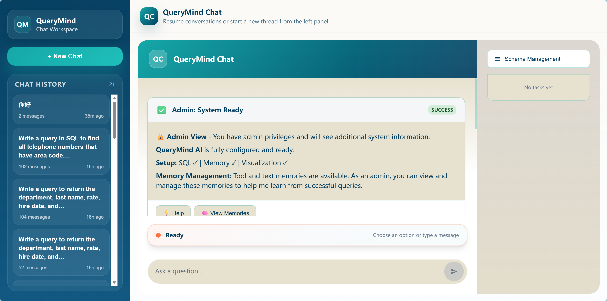

# Conversation Store & History Management


Conversation storage is the durable source of truth for QueryMind's multi-turn behavior. It is separate from `AgentMemory`: the store keeps exact chat turns and tool traces, while `AgentMemory` keeps reusable patterns and semantic notes.

## Conversation Data Model

`Conversation` contains `id`, `user`, `messages`, `created_at`, `updated_at`, and free-form `metadata`. `Message` carries `role`, `content`, `timestamp`, optional `metadata`, optional `tool_calls`, optional `tool_result`, and optional `tool_call_id`.

The `ConversationStore` interface is intentionally small:
- `create_conversation(...)`
- `get_conversation(...)`
- `update_conversation(...)`
- `delete_conversation(...)`
- `list_conversations(...)`

The point is not to model every chat feature here. The point is to define a minimal persistence contract that can back a demo, a local filesystem, or another backend without changing the agent.

## Conversation Lifecycle^

```text
┌──────────────────────────────┐     ┌──────────────────────────────┐
│ Client sends message        │ --> │ ChatHandler creates           │
│ and optional conversation_id│     │ conversation_id/request_id   │
└──────────────────────────────┘     └──────────────┬───────────────┘
                                                    │
                                                    ▼
┌──────────────────────────────┐     ┌──────────────────────────────┐
│ Agent resolves user         │ --> │ Load conversation            │
│ from RequestContext         │     │ or create empty one          │
└──────────────────────────────┘     └──────────────┬───────────────┘
                                                    │
                                                    ▼
┌──────────────────────────────┐     ┌──────────────────────────────┐
│ Add user message            │ --> │ Build LLM request from       │
│ to Conversation             │     │ filtered history             │
└──────────────────────────────┘     └──────────────┬───────────────┘
                                                    │
                                                    ▼
┌──────────────────────────────┐     ┌──────────────────────────────┐
│ LLM returns tools or final  │ --> │ Append assistant/tool        │
│ response                    │     │ messages to history          │
└──────────────────────────────┘     └──────────────┬───────────────┘
                                                    │
                                                    ▼
┌──────────────────────────────┐     ┌──────────────────────────────┐
│ Auto-save enabled?          │ --> │ update_conversation()        │
│ yes -> persist              │     │ keeps raw history            │
└──────────────────────────────┘     └──────────────────────────────┘
```

The important design choice is that the store keeps raw history. Filters and enrichers derive their own views later. That makes the persisted conversation easy to replay, debug, and reuse.

## In-Memory Conversation Store (Demo)

`MemoryConversationStore` is the simplest backend. It keeps a `Dict[str, Conversation]` in process memory, scopes reads and deletes by `user.id`, and sorts conversation lists by `updated_at`.

Why it exists:
- fast local development
- unit tests and demos
- zero external dependencies

Tradeoff:
- it is ephemeral
- it does not survive restart
- it is not enough when you need history-driven enrichers that depend on recent-message lookup

The agent can use this backend by default when no store is injected. That keeps local startup easy, while the interface still allows a persistent backend later.

## File System Conversation Store^

```text
conversations/
  conv_12345678/
    metadata.json
    messages/
      1700000000000000_000000.json
      1700000001000000_000001.json
```

`FileSystemConversationStore` persists each conversation as a directory. `metadata.json` stores the conversation id, user payload, and timestamps. Each message is stored as its own JSON file inside `messages/`, ordered by a timestamp-plus-index filename.

Read/write behavior:
- `create_conversation()` writes metadata and the first user message.
- `update_conversation()` rewrites metadata and appends only the unseen messages.
- `get_conversation()` reloads metadata and messages, then reconstructs the `Conversation`.
- `delete_conversation()` verifies ownership before removing files.
- `list_conversations()` walks the directory tree, filters by owner, sorts by `updated_at`, and paginates.
- `get_recent()` returns the newest N messages for history-aware enrichers.

Why this backend matters:
- conversations are inspectable outside the app
- persistence survives process restarts
- append-only message files make manual debugging and recovery easier
- `get_recent()` unlocks follow-up behaviors that need a small history window

## Common Use Patterns

The same store serves three different read paths:
- the LLM sees filtered messages
- the chat history UI sees conversation summaries
- context enrichers see recent structured events

That is why the store is the source of truth, not the final prompt.

### Retrieving Conversation History for Context^

```text
┌──────────────────────────────┐
│ ConversationStore            │
│ raw conversation history     │
└──────────────┬───────────────┘
               │
      ┌────────┴────────┐
      ▼                 ▼
┌──────────────┐   ┌──────────────────────┐
│ Conversation │   │ get_recent(limit=10) │
│ filters      │   │ for enrichers        │
└──────┬───────┘   └──────────┬───────────┘
       │                      │
       ▼                      ▼
┌───────────────────┐   ┌──────────────────────────┐
│ LLM request       │   │ SchemaRetrieveContextEnricher
│ filtered messages │   │ injects schema_retrieve_context
└───────────────────┘   └──────────────────────────┘
```

`ConversationFilter` objects run in order inside `Agent._build_llm_request()`. They can trim context, remove sensitive text, or summarize long threads before the request is sent to the LLM.

This is different from `SchemaRetrieveContextEnricher`, which reads recent messages from the store and extracts structured tool output. In other words:
- filters shape what the model sees
- enrichers shape what tools see
- the store itself stays unchanged

That split is deliberate. Raw history remains intact, while later reads can be tailored for different consumers.

### Listing User's Conversations (Chat History UI)



The FastAPI history endpoints use the same store to power the UI:
- `/api/querymind/v1/chat/conversations` lists the current user's conversations
- `/api/querymind/v1/chat/conversations/{conversation_id}` returns the full message history
- `DELETE` removes a conversation for the current user

The UI list is intentionally compact. It skips empty starter sessions, uses the first user message as the title, uses the latest message as the preview, and sorts by `updated_at` so the newest thread appears first.

This keeps the history drawer useful without requiring an extra summary index in storage.

### Manual Conversation Save

Auto-save is enabled by default in `AgentConfig`, but persistence is still explicit. The agent calls `update_conversation()` after a normal turn, after a workflow-only turn, and after starter UI responses when auto-save is on.

That gives custom integrations a clear control point:
- mutate the in-memory `Conversation`
- call `update_conversation(conversation)` when you want to persist it

On the file-system backend, that save path is cheap because only new messages are appended. On the in-memory backend, the current conversation object simply replaces the previous one.

## Use Case: Schema Retrieve Search Model Selection*

This is the most interesting history-driven use case in the codebase.

A schema search result is not just a one-off answer. It becomes state for the next turn:
1. the first `schema_retrieve` call stores `selected_tables`, `selected_table_refs`, `graph_hint`, and related metadata in the tool result
2. `SchemaRetrieveContextEnricher` reads the recent conversation window with `get_recent(limit=10)`
3. the enricher finds the latest `schema_retrieve` result and injects `schema_retrieve_context`
4. the next `schema_retrieve` call can switch to `expand` mode and continue from the seed tables

```text
Turn 1
┌──────────────────────────────┐
│ "find customer tables"       │
└──────────────┬───────────────┘
               ▼
┌──────────────────────────────┐
│ schema_retrieve result       │
│ selected_tables = [...]      │
└──────────────┬───────────────┘
               ▼
┌──────────────────────────────┐
│ ConversationStore persists   │
│ tool result metadata         │
└──────────────┬───────────────┘

Turn 2
┌──────────────────────────────┐
│ "expand from those"          │
└──────────────┬───────────────┘
               ▼
┌──────────────────────────────┐
│ get_recent() finds last      │
│ schema_retrieve result       │
└──────────────┬───────────────┘
               ▼
┌──────────────────────────────┐
│ seed_tables injected into    │
│ context.metadata             │
└──────────────┬───────────────┘
               ▼
┌──────────────────────────────┐
│ LLM can choose expand mode   │
└──────────────────────────────┘
```

The innovation here is that conversation history is used as a low-friction state bus, not just as a transcript. The system does not force the model to remember table choices in prose. Instead, it recovers the last structured tool result and lets the next turn continue from that state.

That gives QueryMind a few practical advantages:
- multi-turn schema exploration becomes deterministic
- the model can continue an earlier search without re-deriving the same tables
- the store preserves the full thread for debugging while the enricher extracts just the needed state

## Closing Note

Conversation storage is the bridge between turns. It keeps the raw record, supports UI history, feeds context filters, and makes structured follow-up behavior possible without overloading the LLM prompt.


<details open>
<summary>Relevant source files</summary>

- [`src/QueryMind/core/agent/agent.py`](../../../src/QueryMind/core/agent/agent.py) - loads, filters, and persists conversations during the main agent loop
- [`src/QueryMind/core/agent/config.py`](../../../src/QueryMind/core/agent/config.py) - auto-save and conversation-related agent settings
- [`src/QueryMind/core/user/request_context.py`](../../../src/QueryMind/core/user/request_context.py) - request metadata passed into user resolution
- [`src/QueryMind/core/user/resolver.py`](../../../src/QueryMind/core/user/resolver.py) - user resolution interface used at chat entry
- [`src/QueryMind/core/user/models.py`](../../../src/QueryMind/core/user/models.py) - user identity model used for ownership and scoping
- [`src/QueryMind/server/base/chat_handler.py`](../../../src/QueryMind/server/base/chat_handler.py) - framework-agnostic chat entrypoint that creates request context and streams responses
- [`src/QueryMind/server/fastapi/routes.py`](../../../src/QueryMind/server/fastapi/routes.py) - conversation history API and chat UI routes
- [`src/QueryMind/core/workflow/base.py`](../../../src/QueryMind/core/workflow/base.py) - workflow handler interface for starter UI and deterministic handling
- [`src/QueryMind/core/workflow/default.py`](../../../src/QueryMind/core/workflow/default.py) - default starter UI, command handling, and admin checks
- [`src/QueryMind/core/filter/base.py`](../../../src/QueryMind/core/filter/base.py) - conversation filter interface used before LLM requests
- [`src/QueryMind/core/storage/base.py`](../../../src/QueryMind/core/storage/base.py) - conversation storage contract
- [`src/QueryMind/core/storage/models.py`](../../../src/QueryMind/core/storage/models.py) - conversation and message data models
- [`src/QueryMind/core/enricher/schema_retrieve.py`](../../../src/QueryMind/core/enricher/schema_retrieve.py) - history-aware schema retrieval that reuses prior turn state
- [`src/QueryMind/integrations/local/storage.py`](../../../src/QueryMind/integrations/local/storage.py) - in-memory conversation backend
- [`src/QueryMind/integrations/local/file_system_conversation_store.py`](../../../src/QueryMind/integrations/local/file_system_conversation_store.py) - persistent file-backed conversation backend

</details>