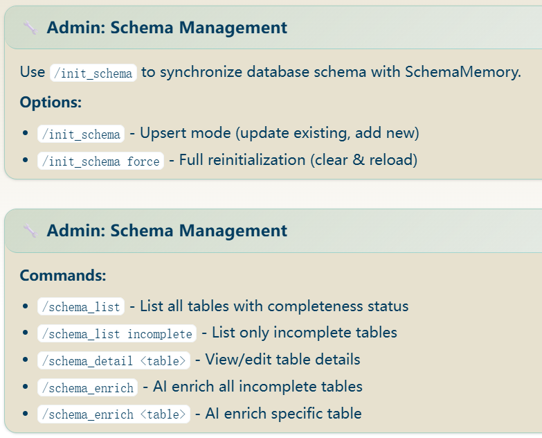
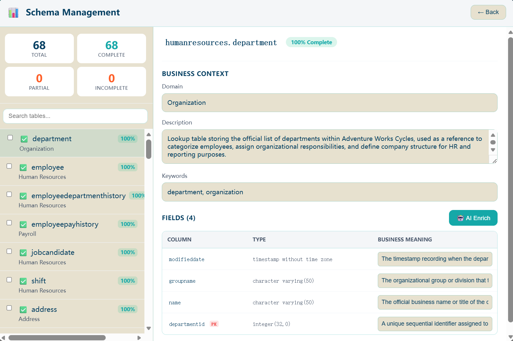

# Agent Memory（RAG）系统

QueryMind 使用两套不同但互补的记忆系统：
- Agent Memory 存储成功的工具路径和可复用的文本知识。
- Schema Memory 存储表结构、表关系和业务上下文。

这两套记忆共同帮助 Agent 复用已经跑通的路径，并在生成 SQL 前先锁定正确的表。

## Agent Memory^

Agent Memory 会存两类可复用经验：
- Tool Memory：成功的 question/tool/args 组合。
- Text Memory：自由文本知识、定义、业务备注。

实际效果是：QueryMind 先把已经跑通的工具路径和笔记存下来，之后遇到类似请求时可以直接复用。

### 记忆流图^
```text
┌──────────────────────────────┐
│ 用户提出问题                 │
└──────────────┬───────────────┘
               ▼
┌──────────────────────────────┐
│ Prompt builder 检查工具      │
│ 并在需要时注入记忆规则       │
└──────────────┬───────────────┘
               ▼
┌──────────────────────────────┐
│ DefaultLlmContextEnhancer    │
│ 检索 text memory             │
└──────────────┬───────────────┘
               ▼
┌──────────────────────────────┐
│ LLM 选择工具并执行           │
└──────────────┬───────────────┘
               ▼
┌──────────────────────────────┐
│ 成功路径再写回 AgentMemory   │
└──────────────────────────────┘
```

### Tool Memory
Tool memory 通过 `save_question_tool_args` 写入，保存的内容包括：
- 原始问题，
- 工具名，
- 真实参数，
- 成功状态，
- 可选元数据。

这比原始聊天记录更有用，因为它保存的是那条真正跑通的工具调用。

#### SaveQuestionToolArgsTool
`SaveQuestionToolArgsTool` 用于保存一次成功的 question/tool/args 组合。

Key Features:
- 写入当前配置的 `AgentMemory` 后端。
- 通过 `ToolContext` 保证记录和当前用户、会话、Agent 关联。
- 返回成功提示和状态型 UI 卡片。
- 识别记忆后端降级，并优雅返回，而不是让整次请求失败。

Behavior:
- 记忆健康时，工具会保存这条成功路径并返回已保存的工具名。
- 记忆降级时，工具仍然对请求流“成功”，但会提示这条路径没有真正持久化。
- 后端抛错时，工具返回结构化失败结果。

#### SearchSavedCorrectToolUsesTool
`SearchSavedCorrectToolUsesTool` 会根据问题搜索过去成功的工具用法。

Key Features:
- 对 agent memory 做相似度检索。
- 支持 `limit`、`similarity_threshold`、`tool_name_filter`。
- 同时返回 LLM 文本和 rich UI 结果。
- 仅在 `UiFeature.UI_FEATURE_SHOW_MEMORY_DETAILED_RESULTS` 开启时展示详细记忆卡片。
- 记忆为空或降级时可安全回退。

Behavior:
- 只搜索“成功”的工具路径。
- 结果里会包含问题、工具名、参数、相似度分数，必要时还会带时间戳和 memory id。
- 后端不可用时，工具会返回安全的提示信息，而不会打断 Agent 循环。

#### SaveTextMemoryTool
`SaveTextMemoryTool` 用于保存自由文本笔记、定义或业务观察。

Key Features:
- 通过 `AgentMemory` 保存文本内容。
- 后端健康时返回保存后的 memory id。
- 后端降级时会优雅跳过持久化。
- 使用轻量状态卡，而不是重型 UI 面板。

Behavior:
- 这个工具适合存诸如缩写、字段语义、业务规则之类的持久化事实。
- tool memory 记动作路径，text memory 记知识。

### Text Memory
Text memory 会在选工具前被读取，默认的 LLM context enhancer 会把相关片段追加到 system prompt。

#### DefaultLlmContextEnhancer
`DefaultLlmContextEnhancer` 会把相关的 text memory 加入 system prompt。

这样做的作用是：
- 能在工具选择前先给模型补充 grounding。
- 尽量把领域知识从用户输入中剥离出去。
- 为可复用笔记提供一个轻量检索入口。

Behavior:
- 没有配置 memory backend 时，prompt 原样返回。
- memory backend 降级时，prompt 原样返回。
- 否则会调用 `search_text_memories()`，把最相关的片段追加到 system prompt。

### 记忆 UI 与命令
QueryMind 通过工具和运维命令两种方式暴露记忆能力。

默认 workflow handler 支持：
- `/memories` 或 `/recent_memories` 查看最近记忆。
- `/delete <memory_id>` 删除 tool memory 或 text memory。

UI 对普通用户和管理员做了区分：
- 普通用户看到的是简洁状态信息，
- 管理员可以查看详细卡片并删除条目。

同一份记忆数据既能被 Agent 在运行时使用，也能被维护者在运维时查看和清理。

### Memory Backend 行为
QueryMind 主要提供两类后端：
- `Mem0AgentMemory`：面向生产的持久化记忆后端。
- `DemoAgentMemory`：零依赖、适合 demo 和测试的本地内存实现。

`DemoAgentMemory` 的特点很直接：
- tool memory 和 text memory 都放在 RAM 里，
- 使用 Jaccard + difflib 这种轻量相似度，
- 支持 FIFO 淘汰，
- 通过锁保证异步安全。

`Mem0AgentMemory` 则更接近真实部署：
- 按 user、agent、conversation 做隔离，
- 每条记录都带元数据，
- 支持相似度检索和 rerank，
- 当 Mem0 不可用时能降级成 no-op 模式。

如果 Mem0 不可用，记忆调用会降级为 no-op，保证 Agent 继续运行。

### 记忆架构图^
```text
┌──────────────────────────────────────────────────────────────────────────┐
│                               Agent Memory                               │
│                                                                          │
│  ┌──────────────────────────┐      ┌──────────────────────────────────┐  │
│  │ SaveQuestionToolArgsTool  │      │ SearchSavedCorrectToolUsesTool  │  │
│  │ SaveTextMemoryTool        │      │ DefaultLlmContextEnhancer       │  │
│  └─────────────┬────────────┘      └──────────────┬───────────────────┘  │
│                │                                  │                      │
│                ▼                                  ▼                      │
│     ┌──────────────────────┐          ┌──────────────────────────────┐    │
│     │ AgentMemory 接口     │          │ search_text_memories()      │    │
│     │ save/search/delete   │          │ search_similar_usage()      │    │
│     └─────────────┬────────┘          └──────────────┬───────────────┘    │
│                   │                                   │                    │
│                   ▼                                   ▼                    │
│      ┌─────────────────────────┐        ┌──────────────────────────────┐   │
│      │ Mem0AgentMemory         │        │ DemoAgentMemory              │   │
│      │ 持久化后端              │        │ 内存后端                     │   │
│      └─────────────┬───────────┘        └──────────────┬───────────────┘   │
│                    │                                   │                   │
│                    ▼                                   ▼                   │
│      ┌─────────────────────────┐        ┌──────────────────────────────┐   │
│      │ Mem0 存储 + rerank      │        │ Jaccard + difflib 相似度     │   │
│      │ user/agent/run 隔离     │        │ FIFO 淘汰                    │   │
│      └─────────────────────────┘        └──────────────────────────────┘   │
└──────────────────────────────────────────────────────────────────────────┘
```

## Schema Memory ^*

Schema Memory 存储表结构、字段、关系和业务上下文。`schema_retrieve` 会读取它，先找到相关表，再让 Agent 生成 SQL。

这一节标记为 `*`，因为 `schema_retrieve` 有四种检索模式：vector、graph、hybrid 和 expand。

### 两层结构^

Schema Memory 使用两层互补存储：
- Neo4j 存图结构、表关系和 domain 连接。
- Mem0 存向量化后的 schema 文本，用于语义检索。

有些 schema 问题是语义类的：
- 语义类问题，比如“哪些表和订单相关？”
- 结构类问题，比如“这个表通过外键连了哪些表？”

QueryMind 用 vector search 处理语义，用 graph search 处理结构。

#### 双层图^
```text
┌──────────────────────────────────────────────────────────────────────────┐
│                               Schema Memory                              │
│                                                                          │
│     ┌──────────────────────────┐        ┌────────────────────────────┐   │
│     │      Neo4jGraphStore      │        │      Mem0VectorStore      │   │
│     │        图层               │        │        向量层             │   │
│     │                          │        │                          │   │
│     │  Table ─ HAS_FIELD ─ Field│        │  table.to_vector_text()  │   │
│     │  Table ─ FK_TO ─ Table    │        │  语义相似度               │   │
│     │  Table ─ BELONGS_TO ─ Dom │        │  domain/table 过滤       │   │
│     └─────────────┬────────────┘        └──────────────┬───────────┘   │
│                   │                                   │                 │
│                   └──────────────┬────────────────────┘                 │
│                                  ▼                                      │
│                    ┌──────────────────────────────┐                      │
│                    │        SchemaSearch          │                      │
│                    │        融合引擎              │                      │
│                    │                              │                      │
│                    │  RRF score =                │                      │
│                    │  vector_w/(k+rank) +        │                      │
│                    │  graph_w/(k+rank)           │                      │
│                    └──────────────────────────────┘                      │
└──────────────────────────────────────────────────────────────────────────┘
```

### 初始化^

Schema Memory 一般会通过独立的同步步骤初始化：
1. `SchemaExtractor` 从源数据库读取表元数据。
2. `SchemaSyncEngine` 把抽取到的 schema 写入 Schema Memory。
3. `Neo4jMem0SchemaMemory.initialize()` 准备两层存储。

这一步会先把 schema 语料加载好，这样运行时检索就不用临时再扫数据库。

初始化还带有一些实用保护：批处理、临时错误重试、重复失败早停、resume 模式跳过已存在表，以及 `force=True` 做全量重建。

#### 初始化图^
```text
┌──────────────────────────────┐
│ SchemaExtractor              │
│ 读取源数据库                 │
└──────────────┬───────────────┘
               ▼
┌──────────────────────────────┐
│ SchemaSyncEngine             │
│ 分批写入并做重试             │
└──────────────┬───────────────┘
               ▼
┌──────────────────────────────┐
│ Neo4jMem0SchemaMemory        │
│ initialize()                 │
└──────────────┬───────────────┘
               ▼
┌──────────────────────────────┐
│ Neo4j 图层 + Mem0 向量层    │
│ 保存 schema 语料            │
└──────────────────────────────┘
```

### 4 种检索模式^*

Schema retrieval 支持四种模式：
- `vector`：先做语义检索。
- `graph`：先做关系遍历。
- `hybrid`：默认的平衡模式。
- `expand`：基于前一次结果中的 seed table 做扩展。

这些模式让工具可以处理不同类型的查询，而不必对所有请求都使用同一种搜索策略。

#### 模式选择图^
```text
┌──────────────────────────────────────────────────────────────────────────┐
│                         schema_retrieve 工具调用                        │
│                                                                          │
│   query: "..."                                                           │
│   search_mode: 可选                                                      │
│   graph_hint: 可选                                                       │
│   seed_tables: 可选                                                      │
└──────────────┬───────────────────────────────────────────────────────────┘
               ▼
┌──────────────────────────────┐
│ 有 seed_tables 吗？          │
└──────────────┬───────────────┘
        是     │     否
               ▼
┌──────────────────────────────┐    ┌───────────────────────────────────┐
│ expand                        │    │ 根据 query 语义和 hint           │
│ 从 seed tables 开始扩展       │    │ 选择 hybrid/vector/graph         │
└──────────────┬───────────────┘    └─────────────────────┬─────────────┘
               ▼                                          ▼
      ┌───────────────┐                         ┌────────────────────────┐
      │ FK 扩展       │                         │ hybrid / vector / graph │
      └───────────────┘                         └────────────────────────┘
```

#### 各模式适用场景
- `vector` 适合问题主要是语义描述的场景。
- `graph` 适合外键遍历比相似度更重要的场景。
- `hybrid` 适合作为默认值，因为它同时兼顾召回和结构。
- `expand` 适合已经有上一轮 seed table 的场景。

### 上下文注入^

expand 流程依赖两个组件：
- `SchemaRetrieveContextEnricher` 会读取 conversation history，并把 `schema_retrieve_context` 写入 `ToolContext`。
- `SchemaContextEnhancer` 会把检索规则和 schema 摘要注入到 system prompt 和消息里。

这样下一次 `schema_retrieve` 就能直接复用上一轮找到的表。

#### 上下文注入图^
```text
┌──────────────────────────────┐
│ 对话历史中有上一次结果       │
└──────────────┬───────────────┘
               ▼
┌──────────────────────────────┐
│ SchemaRetrieveContextEnricher│
│ 提取 selected_tables         │
└──────────────┬───────────────┘
               ▼
┌──────────────────────────────┐
│ ToolContext.metadata         │
│ schema_retrieve_context      │
└──────────────┬───────────────┘
               ▼
┌──────────────────────────────┐
│ schema_retrieve 工具调用     │
│ 可以使用 expand              │
└──────────────┬───────────────┘
               ▼
┌──────────────────────────────┐
│ SchemaContextEnhancer       │
│ 注入规则和 schema 摘要      │
└──────────────────────────────┘
```

### 检索结果形态
Schema retrieval 同时返回机器可读和人可读两种输出：
- `result_for_llm`：结构化文本摘要。
- `ui_component`：rich schema 卡片。
- `metadata`：选中表、检索模式、graph hint、domain filter、required fields、seed tables。

这样模型和用户都能拿到同一份检索结果，只是展示形式不同。

### 它主要减少什么
Schema memory 主要减少三类常见错误：
- 模型猜错表，
- 模型连错表，
- 模型在多轮对话中丢失上下文。

它通过分离以下职责来规避这些问题：
- schema 抽取，
- 持久化存储，
- 检索策略，
- 上下文注入，
- 用户可视化展示。

这样每一步职责更清晰，检索路径也更容易排错。

### Schema Memory 总图^*
```text
┌──────────────────────────────────────────────────────────────────────────┐
│                              Schema Memory                               │
│                                                                          │
│   源数据库 → SchemaExtractor → SchemaSyncEngine → Neo4j/Mem0 存储       │
│                                                                          │
│   运行时查询 → schema_retrieve → Context Enricher → LLM prompt         │
│                                          │                               │
│                                          ▼                               │
│                               hybrid / vector / graph / expand          │
│                                          │                               │
│                                          ▼                               │
│                                schema card + metadata + seed tables     │
└──────────────────────────────────────────────────────────────────────────┘
```

### Schema Management

Schema Management 提供管理员用的命令和 WebUI，用来查看已存的 schema 数据、编辑业务上下文、补全缺失字段，并删除过期条目。

`/init_schema` 只负责初始化或刷新 schema 语料。Schema Management 负责在初始化后继续维护它。

#### Schema Management Commands


管理员命令很少：
- `/schema_list` 显示所有已存表及其完整度状态。
- `/schema_list incomplete` 只看还需要补全的表。
- `/schema_detail <table>` 或 `/schema_detail <schema>.<table>` 打开单表进行查看和编辑；如果不写 schema，workflow 会回落到 `public`。
- `/schema_enrich` 让 LLM 补全缺失的 domain、description、keywords 和 field meanings；不指定表时，只处理 incomplete tables。
- `/schema_enrich <table>` 只补全指定表。

列表页展示库存和完整度。详情页用于查看和编辑 BusinessContext、字段含义、外键关系和完整度摘要。enrich 命令用于补全缺失信息，也可以一次处理多个 incomplete tables。

#### Schema Management Dashboard (WebUI)


这个 Dashboard 只是同一套 schema management API 的前端。它通过下面这些接口工作：
- `GET /api/querymind/v1/schema/tables`
- `GET /api/querymind/v1/schema/tables/{full_name}`
- `PUT /api/querymind/v1/schema/tables/{full_name}/metadata`
- `POST /api/querymind/v1/schema/tables/{full_name}/enrich`
- `DELETE /api/querymind/v1/schema/tables/{full_name}`
- `POST /api/querymind/v1/schema/tables/delete`

页面主要用于查看和修正。左侧栏提供搜索、统计、勾选选择和批量删除；右侧面板一次只展示一张表，并允许编辑 domain、description、keywords 以及每个字段的 business meaning。所有编辑都会先进入草稿态，AI Enrich 按钮会把补全结果写入草稿，而不是直接盲目提交。整个管理面依然只对 admin 开放。

#### 不是 `/init_schema`
`/init_schema` 是导入/初始化步骤，Schema Management 是后续维护步骤。

## 结语

QueryMind 记忆系统的目标很简单：让下一次决策有依据。

Agent Memory 记住成功的工具路径和可复用笔记。
Schema Memory 记住表结构、关系和业务上下文。

两者合起来，可以减少重复尝试、错表和错连表。


<details open>
<summary>相关源码文件</summary>

- [`src/QueryMind/core/agent/agent.py`](../../../src/QueryMind/core/agent/agent.py) - 将 memory 能力接入 Agent 运行时
- [`src/QueryMind/core/agent/config.py`](../../../src/QueryMind/core/agent/config.py) - memory 工作流使用的 UI feature flag 与 schema 默认值
- [`src/QueryMind/core/tool/base.py`](../../../src/QueryMind/core/tool/base.py) - memory 相关工具使用的工具接口
- [`src/QueryMind/core/tool/models.py`](../../../src/QueryMind/core/tool/models.py) - memory 流程中复用的 tool context 与 result 模型
- [`src/QueryMind/core/system_prompt/base.py`](../../../src/QueryMind/core/system_prompt/base.py) - system prompt builder 接口
- [`src/QueryMind/core/system_prompt/default.py`](../../../src/QueryMind/core/system_prompt/default.py) - memory-aware agent 使用的默认 system prompt builder
- [`src/QueryMind/core/enhancer/base.py`](../../../src/QueryMind/core/enhancer/base.py) - LLM context enhancer 接口
- [`src/QueryMind/core/enhancer/composite.py`](../../../src/QueryMind/core/enhancer/composite.py) - composite enhancer 编排
- [`src/QueryMind/core/storage/base.py`](../../../src/QueryMind/core/storage/base.py) - 历史注入流程使用的 conversation store 接口
- [`src/QueryMind/core/storage/models.py`](../../../src/QueryMind/core/storage/models.py) - conversation 与 message 数据模型
- [`src/QueryMind/capabilities/agent_memory/base.py`](../../../src/QueryMind/capabilities/agent_memory/base.py) - agent memory 接口
- [`src/QueryMind/capabilities/agent_memory/models.py`](../../../src/QueryMind/capabilities/agent_memory/models.py) - tool memory 与 text memory 数据模型
- [`src/QueryMind/capabilities/schema_memory/base.py`](../../../src/QueryMind/capabilities/schema_memory/base.py) - schema memory 接口
- [`src/QueryMind/capabilities/schema_memory/models.py`](../../../src/QueryMind/capabilities/schema_memory/models.py) - schema 存储与检索数据模型
- [`src/QueryMind/capabilities/schema_management/base.py`](../../../src/QueryMind/capabilities/schema_management/base.py) - schema management service 接口
- [`src/QueryMind/capabilities/schema_management/models.py`](../../../src/QueryMind/capabilities/schema_management/models.py) - schema management 的列表与 enrich 数据模型
- [`src/QueryMind/capabilities/schema_extracter/base.py`](../../../src/QueryMind/capabilities/schema_extracter/base.py) - schema 抽取接口与同步引擎
- [`src/QueryMind/capabilities/schema_extracter/models.py`](../../../src/QueryMind/capabilities/schema_extracter/models.py) - schema extraction 结果与初始化模型
- [`src/QueryMind/tools/agent_memory.py`](../../../src/QueryMind/tools/agent_memory.py) - 内置 agent memory 工具
- [`src/QueryMind/tools/schema_retrieve.py`](../../../src/QueryMind/tools/schema_retrieve.py) - 内置 schema retrieval 工具
- [`src/QueryMind/core/enhancer/default.py`](../../../src/QueryMind/core/enhancer/default.py) - 基于 memory 的 LLM prompt 增强
- [`src/QueryMind/core/enhancer/schema_retrieve.py`](../../../src/QueryMind/core/enhancer/schema_retrieve.py) - schema retrieval 的 prompt 规则与模式提示
- [`src/QueryMind/core/enricher/base.py`](../../../src/QueryMind/core/enricher/base.py) - tool-context enricher 接口
- [`src/QueryMind/core/enricher/schema_retrieve.py`](../../../src/QueryMind/core/enricher/schema_retrieve.py) - 基于历史的 schema 检索上下文注入
- [`src/QueryMind/core/workflow/base.py`](../../../src/QueryMind/core/workflow/base.py) - memory 命令使用的 workflow 契约
- [`src/QueryMind/core/workflow/default.py`](../../../src/QueryMind/core/workflow/default.py) - 默认 memory 命令处理与 starter UI
- [`src/QueryMind/core/workflow/composite.py`](../../../src/QueryMind/core/workflow/composite.py) - workflow handler 编排
- [`src/QueryMind/core/workflow/schema_init_workflow.py`](../../../src/QueryMind/core/workflow/schema_init_workflow.py) - `/init_schema` 工作流
- [`src/QueryMind/core/workflow/schema_management_workflow.py`](../../../src/QueryMind/core/workflow/schema_management_workflow.py) - schema management 命令
- [`src/QueryMind/integrations/local/agent_memory/in_memory.py`](../../../src/QueryMind/integrations/local/agent_memory/in_memory.py) - 本地 demo 版 agent-memory 后端
- [`src/QueryMind/integrations/local/storage.py`](../../../src/QueryMind/integrations/local/storage.py) - 内存版 conversation store 实现
- [`src/QueryMind/integrations/local/file_system_conversation_store.py`](../../../src/QueryMind/integrations/local/file_system_conversation_store.py) - 文件持久化的 conversation history 存储
- [`src/QueryMind/integrations/agentmemory/mem0/agent_memory.py`](../../../src/QueryMind/integrations/agentmemory/mem0/agent_memory.py) - Mem0 驱动的 agent-memory 后端
- [`src/QueryMind/integrations/agentmemory/mem0/config.py`](../../../src/QueryMind/integrations/agentmemory/mem0/config.py) - Mem0 agent-memory 连接配置
- [`src/QueryMind/integrations/schemamemory/memory.py`](../../../src/QueryMind/integrations/schemamemory/memory.py) - Neo4j + Mem0 的 schema-memory 后端
- [`src/QueryMind/integrations/schemamemory/schema_search.py`](../../../src/QueryMind/integrations/schemamemory/schema_search.py) - 融合式 schema 检索引擎
- [`src/QueryMind/integrations/schemamemory/vector_layer/vector_store.py`](../../../src/QueryMind/integrations/schemamemory/vector_layer/vector_store.py) - schema memory 使用的向量层
- [`src/QueryMind/integrations/schemamemory/vector_layer/mem0_config.py`](../../../src/QueryMind/integrations/schemamemory/vector_layer/mem0_config.py) - schema 向量层的 Mem0 配置
- [`src/QueryMind/integrations/schemamemory/graph_layer/graph_store.py`](../../../src/QueryMind/integrations/schemamemory/graph_layer/graph_store.py) - schema memory 使用的图层
- [`src/QueryMind/integrations/schemamemory/graph_layer/neo4j_config.py`](../../../src/QueryMind/integrations/schemamemory/graph_layer/neo4j_config.py) - schema 图层的 Neo4j 配置
- [`src/QueryMind/integrations/schemamanagement/neo4j_mem0/neo4j_mem0_schema_management.py`](../../../src/QueryMind/integrations/schemamanagement/neo4j_mem0/neo4j_mem0_schema_management.py) - 具体的 schema management 实现
- [`src/QueryMind/integrations/schemaextractor/sqlite/sqlite_extractor.py`](../../../src/QueryMind/integrations/schemaextractor/sqlite/sqlite_extractor.py) - SQLite schema extractor 后端
- [`src/QueryMind/integrations/schemaextractor/postgres/postgres_extractor.py`](../../../src/QueryMind/integrations/schemaextractor/postgres/postgres_extractor.py) - Postgres schema extractor 后端
- [`src/QueryMind/integrations/schemaextractor/mssql/mssql_extractor.py`](../../../src/QueryMind/integrations/schemaextractor/mssql/mssql_extractor.py) - MSSQL schema extractor 后端
- [`src/QueryMind/components/rich/schema_management/schema_list_component.py`](../../../src/QueryMind/components/rich/schema_management/schema_list_component.py) - schema list UI 组件
- [`src/QueryMind/components/rich/schema_management/schema_detail_component.py`](../../../src/QueryMind/components/rich/schema_management/schema_detail_component.py) - schema detail UI 组件
- [`src/QueryMind/components/rich/schema_retrieve.py`](../../../src/QueryMind/components/rich/schema_retrieve.py) - schema retrieval UI 组件
- [`src/QueryMind/server/fastapi/routes.py`](../../../src/QueryMind/server/fastapi/routes.py) - schema management 的 HTTP API

</details>
